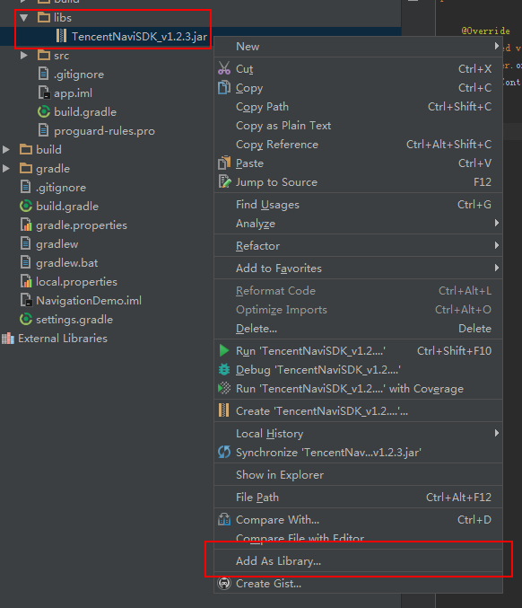
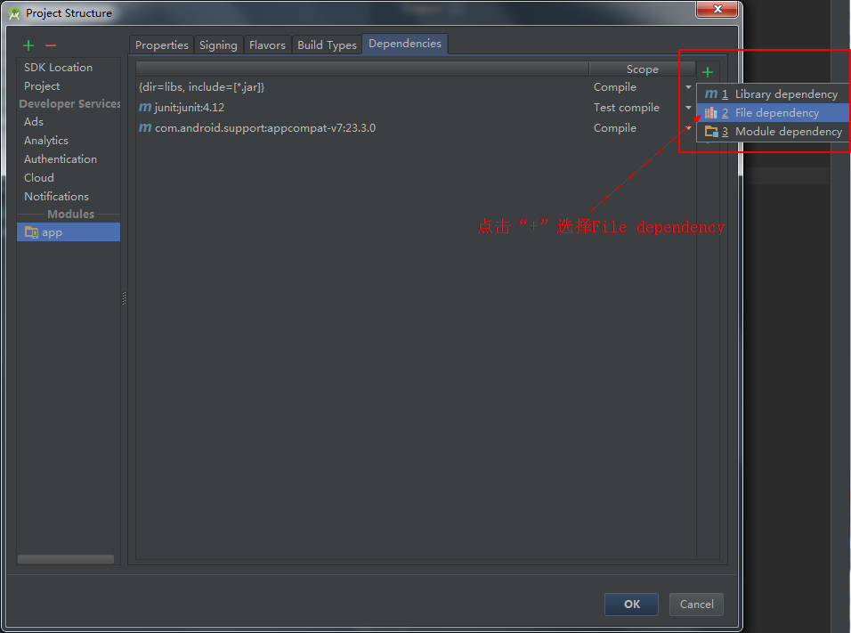
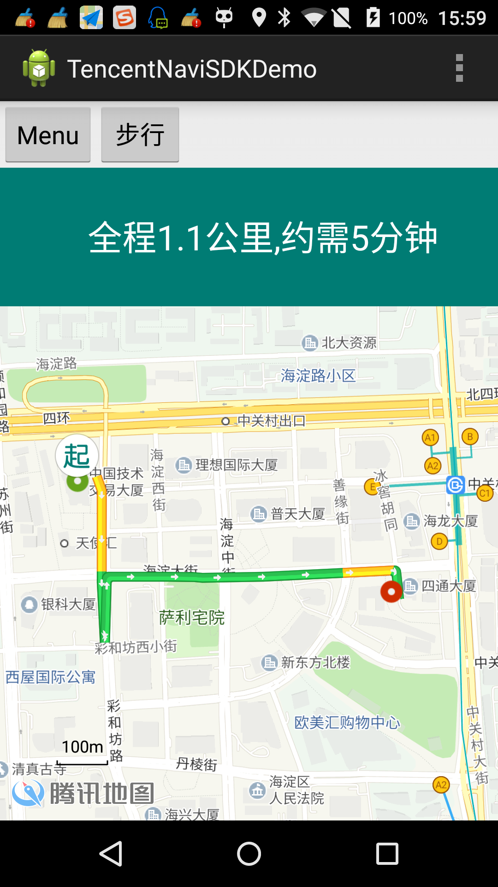
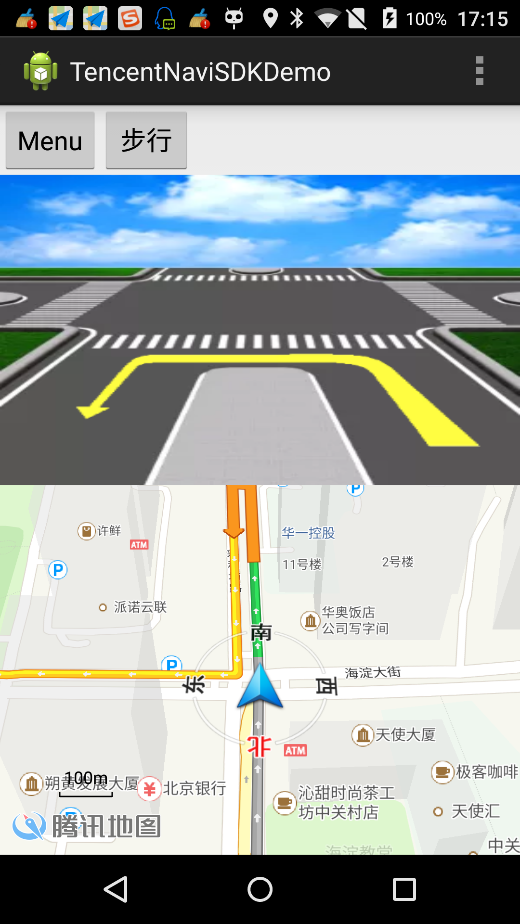

腾讯地图导航SDK开发指南（Android版）
====================================

概述
----

腾讯地图导航SDK（Android版）是一套基于Android
2.3及以上设备的应用程序接口，通过该接口，您可以轻松使用腾讯地图导航服务。下面对腾讯地图导航流程做简要概述：

腾讯地图导航SDK主要负责导航参数设置，如起终点、导航偏好、途径点等，然后进行路线规划。当路线规划成功后，将规划的导航路线传递给导航引擎，导航引擎结合定位信息，进行导航，然后再将导航信息回调给导航SDK。导航SDK根据回调，使用腾讯地图SDK资源进行导航过程的展示。

API是提供给那些具有一定Android编程经验和了解面向对象概念的读者使用。此外，读者还应该对导航产品有一定的了解。您在使用中遇到任何问题，都可以及时向我们反馈。

环境搭建
--------

这里我们只提供eclipse 和Android
Studio下的腾讯地图导航SDK的工程配置方法。

#### 1、准备工作

腾讯地图导航SDK使用腾讯地图SDK（3D地图矢量版）的资源进行导航的展示工作，因此您在使用导航SDK之前，应先配置腾讯地图SDK环境，具体请您参考[*腾讯地图SDK开发指南*](http://lbs.qq.com/android_v1/guide.html)。

#### 2、eclipse

将下载到的压缩包解压，将"TencentNaviSDK_*.jar"（该jar包命名规则为
TencentNaviSDK_vX.X.X.jar, X.X.X为三位版本号）拷贝到工程目录的libs文件夹下，此外，您还需要将对应平台的so文件拷贝到工程目录libs文件夹下对应的平台目录，如下图所示：


注：libtxnavengine.so为导航引擎库；libwebpJNI.so为wepb库，用于路口放大图、电子眼放大图的解码。导航SDK中不含语音播放库，如果使用语音导航，请使用自己的语音库进行语音解码。

#### 3、Android Studio

方法一：将下载到的压缩包解压，将下载到的压缩包解压，将"TencentNaviSDK_*.jar"（该jar包命名规则为
TencentNaviSDK\_vX.X.X.jar, X.X.X为三位版本号）拷贝到app/libs/文件夹下，右键选择"Add As Library"。



此外，需要您在app/src/main/目录下新建jniLibs目录，根据平台的不同将so文件放到对应平台的目录下，如图所示：


方法二：在"Project Structure"中选择"Dependencies", 点击"+"选择"File dependency", 选择要添加到工程的jar包即完成开发包的导入，如图所示：



此外，需要您在app/src/main/目录下新建jniLibs目录，根据平台的不同将so文件放到对应平台的目录下，如图所示：


注：libtxnavengine.so为导航引擎库；libwebpJNI.so为wepb库，用于路口放大图、电子眼放大图的解码。导航SDK中不含语音播放库，如果使用语音导航，请使用自己的语音库进行语音解码。

导航Demo工程设置
----------------

#### 1、添加权限

导航sdk需要使用网络，访问硬件存储等系统权限，在AndroidManifest.xml文件里，添加如下权限：

```xml
<uses-permission android:name="android.permission.INTERNET" />
<uses-permission android:name="android.permission.ACCESS_NETWORK_STATE" />
<uses-permission android:name="android.permission.ACCESS_WIFI_STATE" />
<uses-permission android:name="android.permission.ACCESS_COARSE_LOCATION" />
<uses-permission android:name="android.permission.ACCESS_FINE_LOCATION" />
<uses-permission android:name="android.permission.ACCESS_MOCK_LOCATION" />
<uses-permission android:name="android.permission.WRITE_EXTERNAL_STORAGE" />
<uses-permission android:name="android.permission.READ_PHONE_STATE" />
<uses-permission android:name="android.permission.CALL_PHONE"/>
<uses-permission android:name="android.permission.READ_PHONE_STATE" />
<uses-permission android:name="android.permission.READ_PHONE_SINTERNETWIFI_STATE"/>
<uses-permission android:name="android.permission.WAKE_LOCK" />
<uses-permission android:name="android.permission.CHANGE_WIFI_STATE" />
```

#### 2、使用地图

导航SDK使用腾讯地图SDK资源进行导航展示，该地图SDK的详细使用说明，请参考[*腾讯地图SDK开发指南*](http://lbs.qq.com/android_v1/guide.html)。Demo工程的AndroidManifest.xml文件中，在application节点里，添加名称为TencentMapSDK的meta信息，用于填写开发秘钥。开发秘钥可以到[*这里*](http://lbs.qq.com/key.html)申请。

```xml
<application
   android:allowBackup="true"
   android:icon="@drawable/ic\_launcher"
   android:label="@string/app\_name"
   android:theme="@style/AppTheme" />

<meta-data
   android:name="TencentMapSDK"
   android:value="您的腾讯地图SDK秘钥" />
</application>
```

#### 3、导航流程与参数配置

导航SDK主要负责导航参数设置，如起点，终点等，然后启动异步线程规划路线，路线规划成功后，把导航路线给导航引擎。导航引擎结合定位SDK，进行导航，把导航信息回调给导航SDK。导航SDK根据回调，使用地图SDK进行导航过程的展示。流程图如下：


###### TencentNavigationManager类

导航SDK的设置是通过TencentNavigationManager类进行设置，并由该类暴露对外调用接口，TencentNavigationManager设置底图、比例尺缩放级别、设置导航过程中是否显示电子眼和路口放大图，设置导航的起终点等基本导航设置。此外对于导航的各种回调监听也是绑定到TencentNavigationManager。下面是TencentNavigationManager类的使用示。

```java
// 定义TencentNaviManager对象
private TencentNavigationManager tencentNaviManager = null;

@Override
protected void onCreate(Bundle savedInstanceState) {

    super.onCreate(savedInstanceState);

    // 获取TencentNaviManager实例
    tencentNaviManager = TencentNavigationManager.getInstance(this);

    // 设置tts语音模块监听
    tencentNaviManager.setTtsListener(ttsListener);

    // 设置设置地图对象，这里使用TencentMap的实例
    tencentNaviManager.setMapView(mMap.getMapView());

    // 设置算路回调，非偏航
    tencentNaviManager.setSearchRouteCallbck(searchRouteCallback);

    // 设置偏航算路回调
    tencentNaviManager.setSearchOffRouteCallback(searchOffRouteCallback);

    // 是否开启路口放大图功能
    tencentNaviManager.setCrossingEnlargePictureEnable(true);

    // 设置导航过程中3d模式下，车标位于屏幕的比例
    tencentNaviManager.setNaviFixingProportion(0.5f, 0.75f);

    // 是否开启电子眼放大图功能
    tencentNaviManager.setElectriEyesPictureEnable(true);

    // 是否显示导航的Overlay
    tencentNaviManager.setNavigationOverlayEnable(true);

}
```

###### 设置起点、终点以及途径点

设置起点：
```java
tencentNaviManager.setStartPosition(startPosition);
```
设置终点：
```java
tencentNaviManager.setDestinationPosition (destLatlng);
```
设置途径点：
```java
List<LatLng> listPass = new ArrayList<LatLng>();
listPass.add(passPoint);
tencentNaviManager.setWayPoints(listPass);
```

###### 算路

导航SDK启动异步线程规划路线，路线规划成功后，把导航路线给导航引擎。  
算路：
```java
tencentNaviManager.calculateRoute();
```
使用SearchRouteTask进行异步的路线规划，SearchRouteTask的详情请参考API文档。  
Demo规划的路线如图所示：



###### 开始导航与结束导航

导航引擎结合定位SDK，进行导航，把导航信息回调给导航SDK。导航SDK根据回调，使用地图SDK进行导航过程的展示。

开始导航：
```java
tencentNaviManager.startNavi();
```
结束导航：
```java
tencentNaviManager.stopNavi();
```
导航过程中的地图展示：




导航资源包括：

导航定位图标：  

实时路况信息（彩虹蚯蚓）：  

走过的路置灰:  

路口放大图：  

其他的资源如车道线信息，电子眼放大图等，请您参考API文档。

###### 导航回调

导航SDK提供了丰富的回调函数，来回调导航中的操作。所有的回调事件都绑定在TencentNavigationManager对象上，下面列出了腾讯地图导航支持的回调：

导航过程中回调
```java
TencentNavigationManager.TencentNaviCallback
```
查询路线回调 （非偏航）   
```java
TencentNavigationManager.SearchRouteCallback
```
查询偏航路线回调
```java
TencentNavigationManager.SearchOffRouteCallback
```

上述回调的具体信息，请您参阅API文档。

注意事项
--------

1.  项目必须使用utf8编码格式，如果出现类似“at
    java.net.URLEncoder.encode”的错误，请检查项目编码格式。

2.  导航SDK使用腾讯地图SDK（3D地图矢量版）的地图资源进行展示。请您预先配置腾讯地图SDK环境。

3.  导航SDK不包含定位功能，建议用户使用腾讯定位SDK。

4.  导航SDK不包含语音播报库，建议用户使用TTS语音进行语音播报。

5.  如有问题，可以到腾讯地图开发者论坛，或者技术支持qq群寻求帮助。
